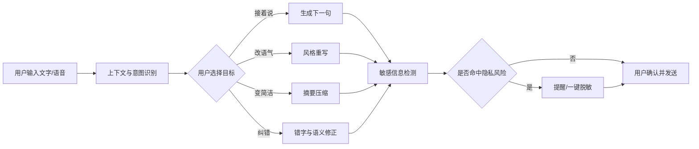

# 句伴 · AI 智能输入助手

一个面向聊天场景的 AI 输入助手 MVP，目标是让用户在发送前更快、更准确、更安全地表达自己。项目包含可交互前端原型与完整产品方案，适合用于产品/AI 产品实习作品集展示。

## 在线运行

无需安装依赖，直接打开 `index.html` 即可体验。当前为本地 Mock 版本，不会上传用户输入。

## 核心功能

- 根据聊天上下文生成下一句回复
- 口语改写为正式、礼貌、简洁等不同语气
- 语音输入后的错字纠正与语义修正（原型层）
- 根据历史表达偏好进行个性化推荐（工作流设计）
- 发送前识别手机号、身份证号、地址等敏感信息
- 将长文本提炼为适合聊天发送的短句

## 文档

- [产品方案](docs/PRD.md)
- [Prompt 与工作流设计](docs/WORKFLOW.md)
- [用户测试与迭代记录](docs/USER_TEST.md)

## 产品流程图

## 后续接入模型

将 `app.js` 中的 `samples` 替换为后端 `/api/suggest` 请求即可。生产版本建议采用“客户端脱敏 → 服务端推理 → 客户端二次检测”的双层保护策略，并默认不保存原始输入。

## 发布到 GitHub Pages

1. 在 GitHub 新建仓库，例如 `ai-input-assistant`。
2. 将本目录中的文件上传到仓库根目录。
3. 在仓库 `Settings → Pages` 中选择 `Deploy from a branch`，分支选择 `main`、目录选择 `/root`。
4. 等待 Actions 完成后，即可获得可分享的在线原型链接。
